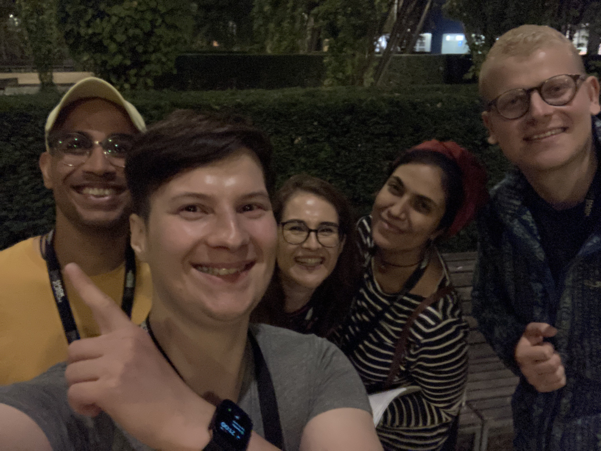

# HackZürich2023
> Teamname: Sahnehäubchen

> Teammembers: Cristine Bucher, David Eggenberger, David Melamed, Mina & Mirna

## Short description
This application serves as a valuable tool for Sika AG, addressing the challenge of managing product information across its global operations. With its chatbot interface and integration of OpenAI technology, it ensures that customers have easy access to accurate and timely information, enhancing their overall experience. Moreover, the inclusion of the FUN-Button adds an element of delight to the interaction, making it a comprehensive and user-friendly solution.

## Introduction
In this application, we address a common challenge faced by Sika AG, a prominent Swiss multinational specialty chemical company. Sika AG operates in both the building sector and the motor vehicle industry, offering a wide range of products and services for bonding, sealing, damping, reinforcing, and protection. With its global presence, the company has over 33,000 employees, subsidiaries in more than 100 countries, and generates an annual sales turnover of CHF 10.5 billion. Sika's rich history dates back to 1910 when Kaspar Winkler laid the foundation for the company. Over time, Sika has expanded its reach, establishing numerous subsidiaries worldwide and introducing a diverse portfolio of over 900 product brands.

## The Problem
One of the significant challenges Sika AG faces is the efficient management of product availability, descriptions, and related information across its global branches. Due to its extensive presence, ensuring that customers have access to accurate and up-to-date information about Sika's products can be a complex task. Traditional methods of cataloging and organizing this vast amount of data often fall short, leading to potential gaps in information and customer frustration.

## The Solution - Building the Application
To address these challenges and maintain a clear overview of product stock and information, we have developed a specialized application. This application takes the form of a chatbot with access to Sika's entire database. Customers can interact with the chatbot, making specific inquiries about products and related details.

## Leveraging Azure Technology
To make this chatbot an effective tool, we have integrated OpenAI and Azure. OpenAI is used to analyze and match patterns between customer queries and the vast database of documents within Sika AG. Azure is used to host the application, store the files (Azure Blob Storage). Various Azure Cognitive Services (Translator, Custom Vision and Language) are used to make the translation into the desired languages work, to extract key information from the PDFs and Pictures in the PDFs. 

## Features
- The Backend crawls through the PDFs and extracts text and the images
- With Azure the text is summarized and tags for the images are detected
- Users can manually upload PDFs and optionally specify languages in which they want the calculated summary of the PDF to be translated
- Users can search through all of Sika's PDF documents and images
- They can then specify one document and generate a new version (through specifying length of new document (keywords, summarization or full text). The users can also specify which pictures they want to have in the newly generated PDF.
- Through the Report endpoint an Excel file can be retrieved that says how many time which document has ben searched for and how many derivations have been created
- Through the Backend new chats can be created (targeted towards the Client). To these chats messages can be added which are then answered by the Backend through calling OpenAI. 

## The FUN-Button
In addition to its primary functionality, the application features a FUN-Button, adding an element of entertainment and engagement for users. By clicking the FUN-Button, customers can access amusing facts about Sika's products or discover interesting comments and quotes related to product descriptions and the company itself.
